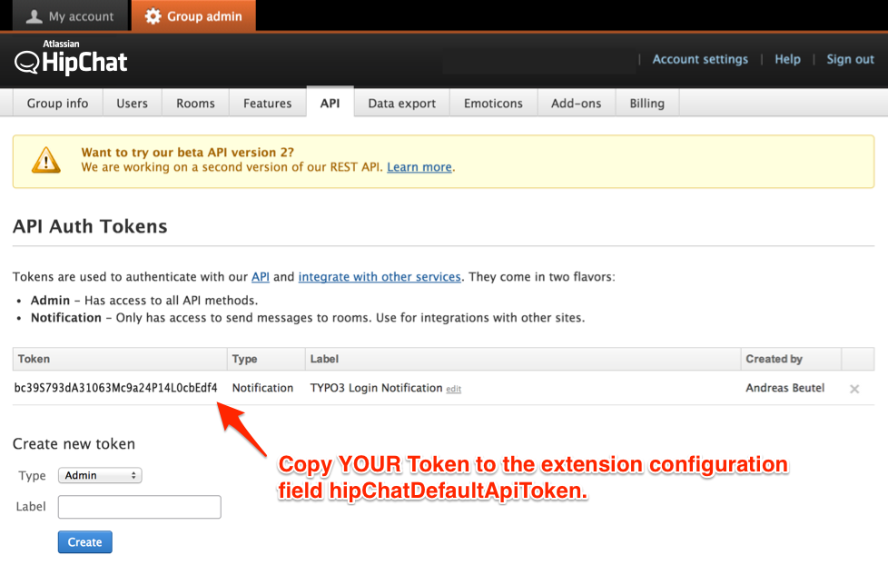

.. ==================================================
.. FOR YOUR INFORMATION
.. --------------------------------------------------
.. -*- coding: utf-8 -*- with BOM.

.. include:: ../Includes.txt

.. _admin-manual:

Administrator Manual
====================

The HipChat extension provides methods to access the HipChat Rest API.
Configuration is straightforward currently - only API Token, Room Name
and »From« are required after installation.

Installation
------------

Create a HipChat API Token for TYPO3 HipChat on the HipChat website https://www.hipchat.com/ if not already done.
A notification token is sufficient in the current version of this extension.

Create Token
^^^^^^^^^^^^
To create a token, sign in in on the HipChat site, navigate to »Group Admin« > API and create a token.

.. figure:: ../Images/AdministratorManual/HipChatCreateToken.png
	:width: 306px
	:alt: Create Token Form

			Create Token Form for HipChat API

A notification (1) token is sufficient in the current version of this extension. Use any token label (2) you like.

Manage Tokens
^^^^^^^^^^^^^
If the token has been created successfully, you should see it in the list view of the token overview for HipChat.

Install and configure HipChat extension
^^^^^^^^^^^^^^^^^^^^^^^^^^^^^^^^^^^^^^^
Now install the extension and fill in the token value (1) and the room name (2). The room **must** exist
and the name must be exactly the same as in HipChat. Choose a »from« name. Log out and in to test notifications.

	Extension Options for HipChat - fill with your values

In the **Notification** tab you may choose the desired way of notification tranmission. Choose email (disables HipChat notifications), HipChat and email notifications (default), or HipChat only to disable email notification.

	Extension Notification Options for HipChat - select your desired way of notification

Example Notifications
---------------------

If everything went right, you should see your logins in our HipChat room.

